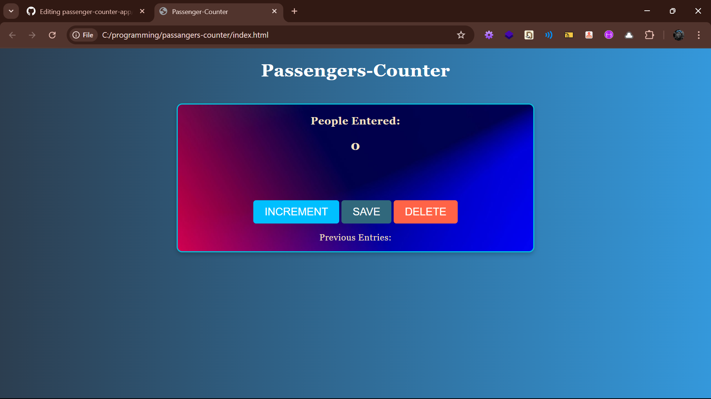

# passenger-counter-app
# 🧮 Passenger Counter App

A simple web app to count, save, and reset passenger entries using HTML, CSS, and JavaScript. Great for learning basic DOM manipulation and styling.

## 🚀 Features

- **Live Count Updates** – Increment the counter with a button click.
- **Save Entries** – Store and display all previously saved passenger counts.
- **Reset/Delete Function** – Clear the display for a fresh count.

## 🖼️ Preview

## 📁 Project Structure

passenger-counter-app/
│
├── index.html # Main HTML file
├── styling.css # Styling with background and buttons
├── scriptt.js # JavaScript logic
└── photo.jpg # Background image used in the card
Open in Browser:
Just open index.html in any modern browser.

📸 UI Highlights
## Responsive and centered layout.

 ##Stylish gradient background.

## Attractive hover effects on buttons.

## Uses a background image in the main container.

🛠️ Technologies Used
  ## HTML5

## CSS3

## JavaScript (Vanilla)

🤝 Contributing
Contributions are welcome! Please open issues and pull requests for improvements, bugs, or new features.

Made with ❤️ by Ayush Srivastava
A simple web app to count, save, and reset passenger entries using HTML, CSS, and JavaScript. Great for learning basic DOM manipulation and styling.
